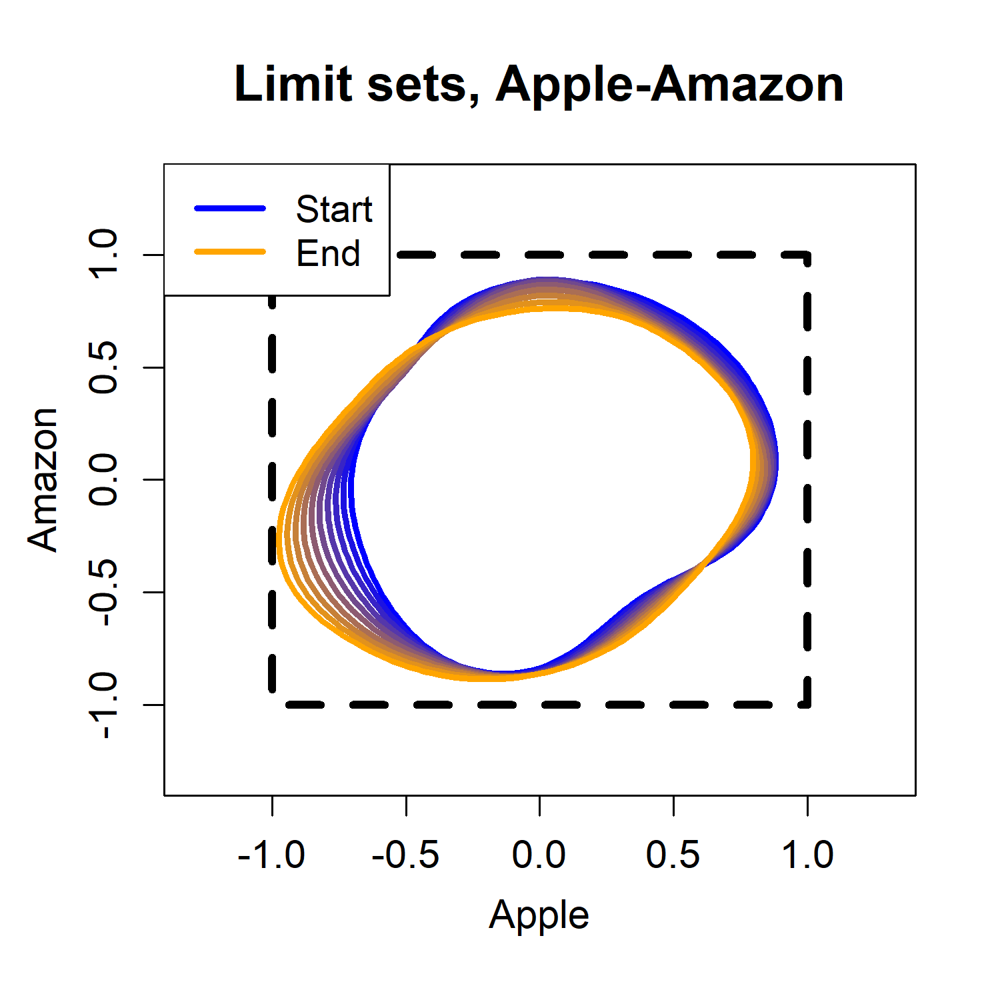

# NSGE: Non-Stationary Geometric Extremes

**Example R code for fitting the geometric framework proposed in Murphy-Barltrop et al. (2025) for modelling time-varying extremal dependence.**

<p align="center">
  
</p>

In order to use the **NSGE** codebase in R, you first need to download and install the Github version of the *evgam* package (Youngman, 2019, 2022). Instruction for this are provided below. 

## Instructions for installing *evgam* from Github

First, run the following code to ensure the *remotes* R package is available.  

```r
packages = c("remotes")
package.check <- lapply(
  packages,
  FUN = function(x) {
    if (!require(x, character.only = TRUE)) {
      install.packages(x, dependencies = TRUE)
      library(x, character.only = TRUE)
    }
  }
)
```

Restart the R session. Then, run the following lines. 

```r
library("remotes")
remotes::install_github("byoungman/evgam")
```

Again, restart the R session. The provided code is now ready to run.

## Instructions for fitting the modelling framework

In the folder **FilteredReturns_APPL_AMZN**, we have provided code for reproducing part of the financial case study from the article. In particular, one can reproduce all of the plots associated with the Apple-Amazon pairing. The code is self-explanatory and commented. One should run through the script **fitting_models.R** in **FilteredReturns_APPL_AMZN** sequentially; this will guide you through every part of the model fitting procedure. 

## Descriptions of the provided folders and R scripts 

Below, we provide brief descriptions of each folder and R script.

**Folders:**

* **Figures** - folder containing R code and plots. This can be used to reproduce many of the plots from the article, and to gain intuition regarding the geometric interpretation of the framework
* **FilteredReturns_APPL_AMZN** - folder containing the code required for reproducing part of the case study from the article
* **FilteredReturns_APPL_AMZN/data** - folder for storing data related to the Apple-Amazon model fit, such as log-return series', spline coefficients, and parameter estimates
* **FilteredReturns_APPL_AMZN/figures** - folder for storing all figure obtained from the Apple-Amazon model fit
  
**R scripts:**

* **Figures/example_figures.R** - R script for recreating many of the plots from the article
* **FilteredReturns_APPL_AMZN/fitting_models.R** - R script for fitting the radial and angular models to the Apple-Amazon data

The remaining **preamble.R** files in both folders contain required functions and packages for fitting the modelling framework(s). 

## Questions?

Please get in touch via email if you have any questions, or if you find a bug in the code: callum.murphy-barltrop[at]tu-dresden.de 

### References

Murphy-Barltrop, C. J. R., Wadsworth, J. L., de Carvalho, M., & Youngman, B. D. (2025). Modelling non-stationary extremal dependence through a geometric approach. arXiv preprint. 

Youngman, B. D. (2019). Generalized additive models for exceedances of high thresholds with an application to return level estimation for US wind gusts. Journal of the American Statistical Association, 114(528), 1865-1879.

Youngman, B. D. (2022). evgam: An R package for generalized additive extreme value models. Journal of Statistical Software, 103, 1-26.
